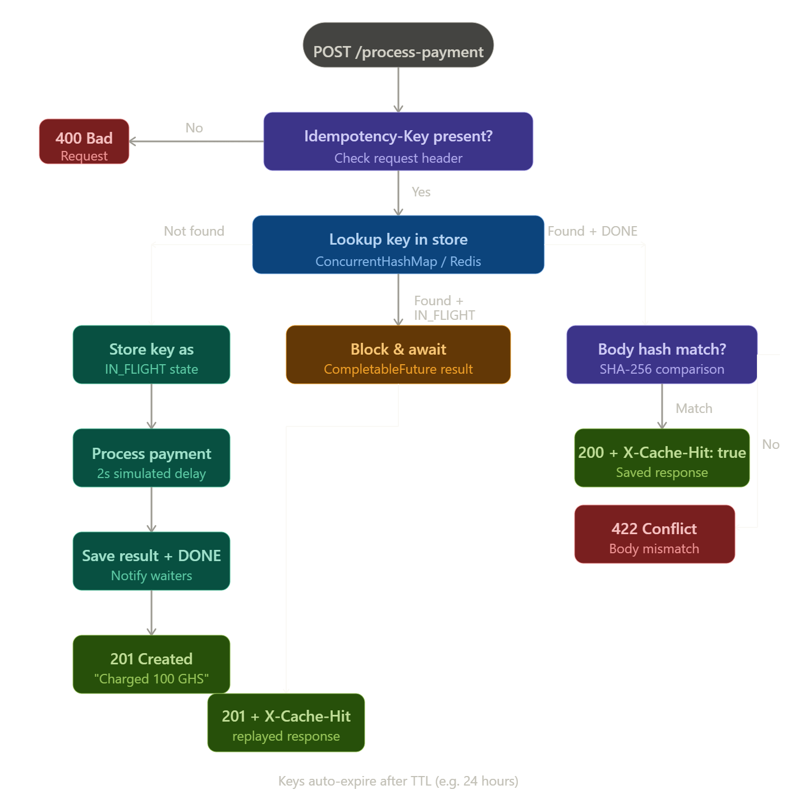
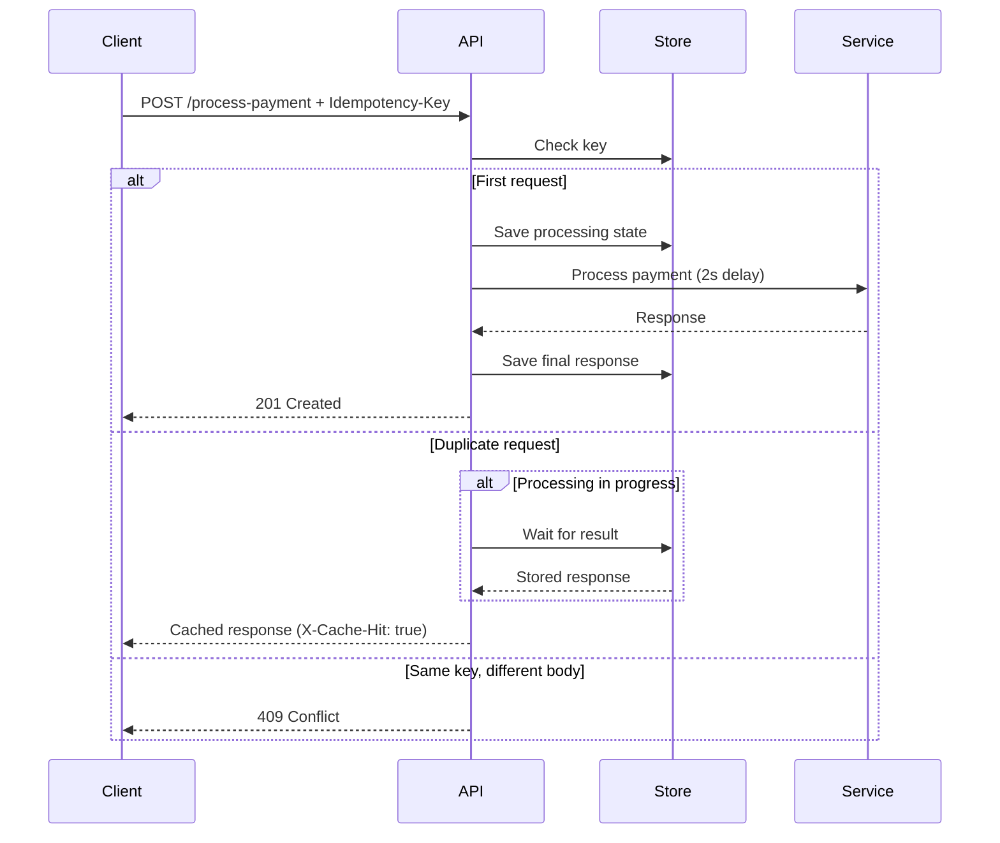

# Idempotency Gateway (Pay-Once Protocol)

A RESTful API that guarantees **exactly-once payment processing** using an `Idempotency-Key`.

This project solves the **double-charging problem** caused by network retries by ensuring that duplicate requests return the **same stored response**, instead of being processed again.

---
#  Features

* Process payments via `POST /process-payment`
*  Idempotency support using `Idempotency-Key`
*  Duplicate request replay (no double charge)
*  Conflict detection (same key, different payload)
*  In-flight request handling (race condition safe)
*  24-hour TTL for idempotency keys (extra feature)
---

#  Architecture






---

#  Setup Instructions (Windows + VS Code)
## 1. Prerequisites

Install the following:

* Java 17+
* Maven OR use Maven Wrapper
* Visual Studio Code
* Postman (for testing)

---

## 2. Clone Repository
```bash
git clone <your-repo-link>
cd idempotency-gateway
```

---

## 3. Run the Project
### Option A (Recommended – no setup needed)
```bash
./mvnw spring-boot:run
```

### Option B (If Maven installed)
```bash
mvn spring-boot:run
```

---

## 4. Server
The server starts at:

```bash
http://localhost:8080
```

---

#  API Documentation

## 🔹 Endpoint
### `POST /process-payment`

---

## 🔹 Headers

| Key             | Value            |
| --------------- | ---------------- |
| Idempotency-Key | unique-string    |
| Content-Type    | application/json |

---

## 🔹 Request Body

```json
{
  "amount": 100,
  "currency": "GHS"
}
```

---

## 🔹 Success Response (First Request)

```json
{
  "message": "Charged 100 GHS",
  "amount": 100,
  "currency": "GHS",
  "processedAt": "2026-05-07T10:00:00Z"
}
```

Status:

```
201 Created
```

---

## 🔹 Duplicate Request Response

* Same response body
* Same status code
* Additional header:

```
X-Cache-Hit: true
```

---

##  Conflict Error (Same Key, Different Body)

```json
{
  "error": "Idempotency key already used for a different request body."
}
```

Status:

```
409 Conflict
```

---

# Testing Guide

## Using Postman

### First Request

* Set header:

```
Idempotency-Key: test-1
```

* Send request → takes ~2 seconds

---

### Duplicate Request

* Send the same request again
* Response:

  * Instant
  * Header: `X-Cache-Hit: true`

---

### Conflict Test

* Change request body:

```json
{
  "amount": 500,
  "currency": "GHS"
}
```

* Use same key → returns `409`

---

### In-Flight Test (Bonus Requirement)

1. Send request
2. Quickly send same request again
3. Second request:

   * Waits
   * Returns same result
   * No duplicate processing

---

#  Design Decisions

### 1. Idempotency Strategy

* Each request is identified using an `Idempotency-Key`
* Request body is hashed (SHA-256) to ensure integrity

---

### 2. In-Memory Store

* Used `ConcurrentHashMap`
* Fast and simple for this challenge

---

### 3. In-Flight Handling

* Used `CompletableFuture`
* Ensures:

  * No duplicate execution
  * Safe concurrent requests

---

### 4. Response Caching

* Full response stored (status + body)
* Ensures exact replay

---

# Developer’s Choice (Extra Feature)

### Idempotency Key Expiry (TTL)

* Each key expires after **24 hours**
* Prevents:

  * Memory leaks
  * Unlimited growth
* Mimics real-world payment systems

---
